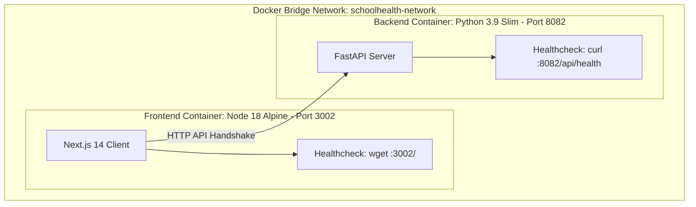

# POC-40-SchoolHealthScreeningDashboard-Awaaz-Phase2

School Health Screening Dashboard is a high-performance healthcare intelligence platform built for the **Infocreon Internship (PoC #40 - Phase 2)**. It maps student vision, hearing, dental, and BMI screening coverage across Gulf school systems (UAE and Saudi Arabia) and tracks the referral-to-treatment follow-up loop.

---

## 👨‍💻 Developer Signature
- **Developer**: **Awaaz Muhammed**
- **GitHub Username**: [@Awaaz-123](https://github.com/Awaaz-123)
- **Program**: **Infocreon Internship (PoC #40 - Phase 2)**
- **Phase 2 Repository**: [POC-40-SchoolHealthScreeningDashboard-Awaaz-Phase2](https://github.com/Awaaz-123/POC-40-SchoolHealthScreeningDashboard-Awaaz-Phase2)

---

## 🐳 Phase 2 – Local-to-Cloud Mirroring (Docker Setup)

This repository represents the **Phase 2 deployment-ready evolution** of PoC #40. The application is fully containerized using multi-stage Dockerfiles and Docker Compose to guarantee local-to-cloud environment parity.



---

## 🛠️ Step 1: Project Context Generation (Repomix)

Before containerizing, generate the unified project context map:

```bash
# Run in the repository root directory
npx -y repomix --output repomix-output.xml
```

This generates `repomix-output.xml`, packing the codebase structure and service handshake parameters into a single context document.

---

## 🚀 Step 2: Docker Container Execution Guide

Ensure you have **Docker Desktop** installed and running.

### 1. Spin up the entire stack with Docker Compose
```bash
docker compose up --build
```
*(Or `docker-compose up --build` on older Docker Compose versions)*

### 2. Verify Running Containers
```bash
docker compose ps
```

### 3. Check Container Health Logs
```bash
# View backend logs
docker compose logs -f backend

# View frontend logs
docker compose logs -f frontend
```

---

## 🌐 Container Endpoints & Ports

| Service | Container Name | Host Port | Internal Port | Healthcheck Endpoint |
| :--- | :--- | :--- | :--- | :--- |
| **FastAPI Backend** | `schoolhealth-backend-poc40` | `8082` | `8082` | `http://localhost:8082/api/health` |
| **Next.js Frontend** | `schoolhealth-frontend-poc40` | `3002` | `3002` | `http://localhost:3002/` |

---

## ⚙️ Environment Variables (.env)

| Variable | Default Value | Description |
| :--- | :--- | :--- |
| `BACKEND_PORT` | `8082` | Host port mapped to FastAPI backend |
| `FRONTEND_PORT` | `3002` | Host port mapped to Next.js frontend |
| `NEXT_PUBLIC_API_BASE` | `http://localhost:8082/api` | Base API URL accessible by the browser |

---

## 🔍 Validation Checklist

- [x] `npx repomix` executed and context generated.
- [x] Multi-stage `Dockerfile` created for FastAPI backend.
- [x] Multi-stage `Dockerfile` created for Next.js frontend.
- [x] Unified `docker-compose.yml` configured with healthchecks and container networking.
- [x] `.dockerignore`, `.env`, and `.env.example` set up.
- [x] 100% full-width Main Stage + Click & Open Intelligence Layer preserved.
- [x] Developer Signature (`Awaaz Muhammed | @Awaaz-123`) embedded across UI and docs.

---

## 🛠️ Troubleshooting Notes

1. **Port Collisions**: If port 8082 or 3002 is already in use by another local process, update `BACKEND_PORT` or `FRONTEND_PORT` inside `.env`.
2. **Container Communication**: The frontend communicates with the backend via `NEXT_PUBLIC_API_BASE=http://localhost:8082/api` for browser access or `http://backend:8082/api` for server-side calls inside the bridge network.
3. **Container Restart**: To rebuild and restart containers cleanly:
   ```bash
   docker compose down -v
   docker compose up --build
   ```
