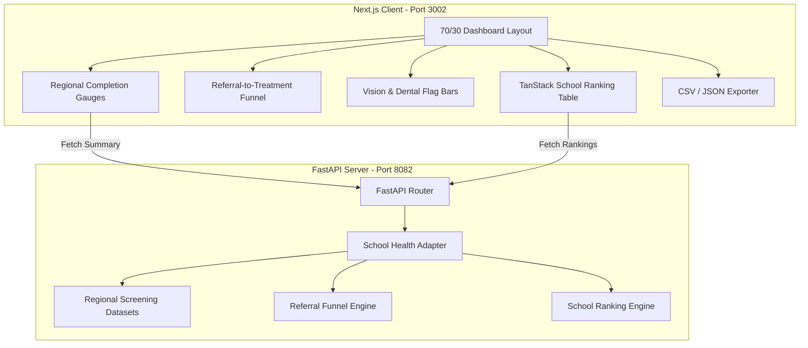

# POC-40-SchoolHealthScreeningDashboard-Awaaz

School Health Screening Dashboard is a high-performance healthcare intelligence platform built as part of the **Real Rails Intelligence Library (PoC #40)**. It maps student vision, hearing, dental, and BMI screening coverage across Gulf school systems (UAE and Saudi Arabia) and tracks the referral-to-treatment follow-up loop.

---

## 📖 Project Overview
The **School Health Screening Dashboard** synthesizes screening data across regional school districts (Dubai, Abu Dhabi, Sharjah, Riyadh, Makkah & Jeddah, Eastern Province) to give education and health authorities real-time visibility into student wellness programs. It monitors screening completion rates, flags early physical health risks (vision impairment, dental caries, hearing deficits, and childhood obesity trends), and tracks clinical referral follow-through.

## ⚠️ Problem Statement
School health screening is the earliest and most cost-effective entry point to catch treatable pediatric conditions before they impair academic performance or progress into chronic illness. However, across Gulf school systems, two critical bottlenecks exist:
1. **The Screening Coverage Gap**: Rural or fast-growing school districts often lag behind mandated annual screening schedules due to nurse staffing shortages or private school operator non-compliance.
2. **The Referral Follow-Up Failure**: Students identified with vision errors, hearing loss, or dental caries frequently drop out of the care pipeline between the initial school screening and the hospital clinic visit due to bureaucratic friction between Ministries of Education (school access) and Ministries of Health (clinical care pathways).

This PoC solves these bottlenecks by providing:
- Regional completion gauges and referral-to-treatment funnels.
- Vision & dental flag-rate comparisons by grade level (Grades 1–12).
- An interactive school-level ranking and compliance table built with TanStack Table.

---

## 🏗️ Architecture Summary

The project consists of a **FastAPI backend** for data orchestration and a **Next.js frontend** for modern dashboard visualizations.



### Key Technical Specs:
1. **Data Ingestion**: Integrates WHO Health-Promoting Schools framework, UAE MOE school health data paradigms, and Saudi MOH screening reports. Supports transparent local mock fallback.
2. **Table Engine**: Built with `@tanstack/react-table` for multi-column sorting, global search filtering, and compliance status badge formatting (`Exemplary`, `Target Met`, `Follow-Up Gap`, `Action Required`).
3. **Analytics Engine**: Powered by Recharts for vertical referral funnels and grade-level flag-rate bar comparisons.
4. **Visual Identity**: Obsidian Black background (`#030712`), Deep Navy Grey surfaces (`#0B1117`), Electric Cyan active accents (`#38BDF8`), and Indigo secondary accents (`#818CF8`).

---

## 📸 Screenshots
Screenshots of the running application are saved under the [screenshots/](file:///Users/awaazmuhammed/Documents/SchoolHealthScreening/screenshots) folder.
- **Main View**: 70/30 Dashboard layout in Obsidian Black showing regional completion gauges and the referral funnel.
- **School Ranking Table**: Interactive TanStack Table with real-time sorting and status badges.

---

## 🤖 AI Usage Summary

- **AI Assistant**: Antigravity (Google DeepMind Advanced Agentic Coding)
- **Model Used**: Gemini 3.6 Flash
- **Development Partnership**:
  - **Planning Mode**: Developed an initial implementation plan outlining the 70/30 layout split, FastAPI routes, and TanStack table integration.
  - **Backend Construction**: Implemented Uvicorn, FastAPI, and Pandas adapters for regional screening summary and referral funnel calculation.
  - **Frontend Construction**: Built the Next.js 14 App Router dashboard with Tailwind CSS v4 colors, Recharts funnel charts, and `@tanstack/react-table` school ranking modules.

---

## 🚀 How to Run the Application

Ensure you have **Python 3.9+** and **Node.js 18+** installed.

### 1. Start the FastAPI Backend
```bash
cd backend
python3 -m venv .venv
source .venv/bin/activate
pip install -r requirements.txt
uvicorn app.main:app --host 127.0.0.1 --port 8082
```
*API Swagger docs will be available at:* `http://127.0.0.1:808/docs`

### 2. Start the Next.js Frontend
```bash
cd frontend
npm install
npm run dev -- -p 3001
```
*The Dashboard UI will be available at:* `http://localhost:3002`

---

## 🔮 Future Enhancements
1. **Live Ministry EMR Integration**: Connect directly to UAE Malaffi / Nabidh and Saudi NPHIES APIs for real-time clinical referral closing verification.
2. **Parent Notification Automation**: Trigger SMS and WhatsApp follow-up reminders to parents of flagged students.
3. **Geospatial Mobile Clinics**: Map underserved schools to route mobile dental and optometry screening vans automatically.
